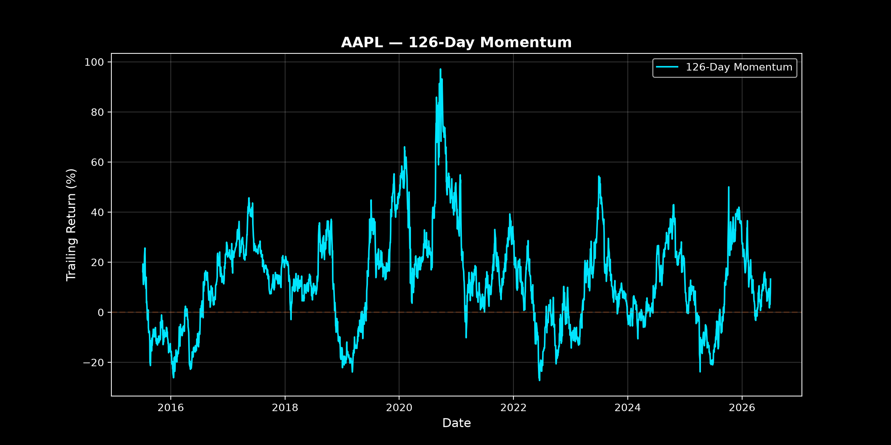
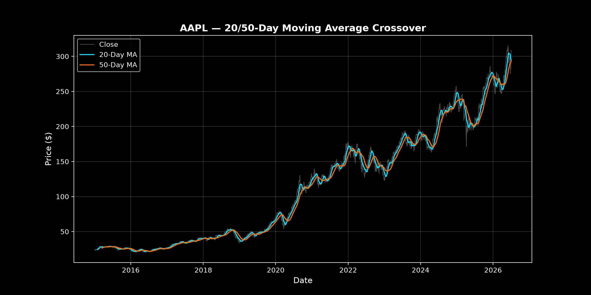
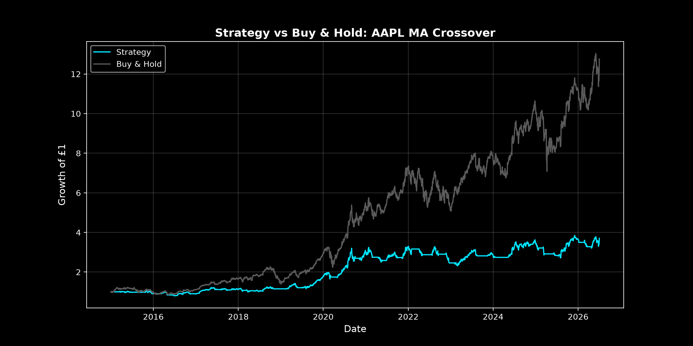
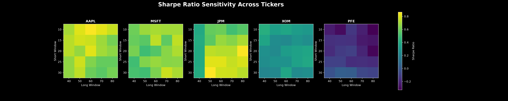
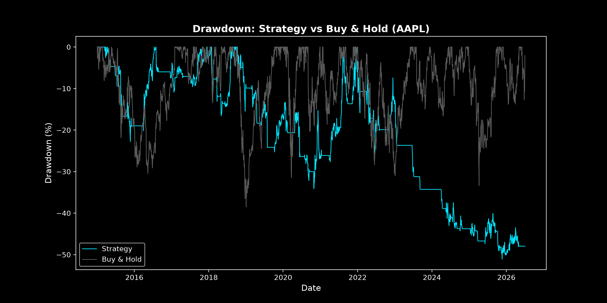

# Quant Backtester

## Overview

This project tests whether two widely-used trading strategies, Moving-Average Crossover and Momentum, would have outperformed a buy-and-hold benchmark across a sample of US equities, and whether any outperformance is statistically significant or a result of overfitting.

## Data

- **Source:** Yahoo Finance
- **Equities:** AAPL, MSFT, JPM, XOM, PFE
- **Time Period:** 2015/01/01 – Present


## Strategies

- **MA Crossover**: Goes long when the short-window moving average is above the long-window moving average.
- **Momentum**: Goes long when the trailing return over a lookback window is positive.

Both strategies use a binary long/flat position. 
Signals are shifted forward by one day to avoid lookahead bias.
This means that a strategy can only act on information available at the end of the previous trading day.

## Methodology 

**Backtesting**

`backtest()` turns a strategy's signal into a compounded equity curve, deducting a 0.1% fixed cost whenever the position changes.

**Performance Metrics**

- Annualised return
- Annualised volume
- Sharpe ratio
- Maximum drawdown
- One-sample t-test on daily returns

**Parameter Sensitivity**

Since strategy parameters can be chosen to fit the historical data, a grid of nearby window pairs was backtested for each ticker, with Sharpe ratios plotted as a heatmap. A stable heatmap suggests a real effect, whereas a patchy one suggests that the result depends on choosing the right parameters, not a genuine edge.

## Results

**AAPL: Momentum**



**AAPL: MA Crossover**



**AAPL: Strategy vs Buy & Hold**



**Sharpe Ratio Sensitivity**



**AAPL: Drawdown for Strategy vs Buy & Hold**



**Final Results Table**

|      |  Annualised Return  |  Annualised Volume  |  Sharpe Ratio  |  Max Drawdown  |  T-Statistic  |  P-Value  |  Buy & Hold Return  |
|:----:|:-------------------:|:-------------------:|:--------------:|:--------------:|:-------------:|:---------:|:-------------------:|
| AAPL |       12.08%        |       19.70%        |     0.678      |    -29.80%     |     2.296     |   0.022   |       24.85%        |
| MSFT |        8.17%        |       19.85%        |     0.495      |    -44.07%     |     1.675     |   0.094   |       22.06%        |
| JPM  |       12.50%        |       18.03%        |     0.743      |    -24.12%     |     2.517     |   0.012   |       18.82%        |
| XOM  |        2.82%        |       19.14%        |     0.241      |    -36.88%     |     0.816     |   0.414   |        7.93%        |
| PFE  |       -3.18%        |       16.06%        |     -0.121     |    -51.06%     |    -0.409     |   0.683   |        2.62%        |

## Key Findings

- **MA crossover underperformed buy-and-hold** on every ticker tested. This is a known weakness of trend-following strategies. The signals lag behind movements in price, which loses returns when the market trends strongly upward for a long stretch. This is roughly what happened for most of this test period.
- **Sharpe ratios were statistically significant for AAPL and JPM**, somewhat significant for MSFT, and not significant for XOM and PFE. This suggests that the performance of XOM and PFE may be due to randomness rather than a genuine effect. 
- **Sharpe ratio was fairly stable across nearby parameter choices** for most tickers, which suggests that the results aren't just a product of one lucky window pair. 

## Limitations

- **No walk-forward validation.** Parameters were checked for stability, but not re-optimised using rolling out-of-sample windows. 
- **No shorting.** Positions are long/flat only. 
- **Survivorship bias.** All tickers are large, currently-listed companies. The sample doesn't include any failed companies, which would bias historical results upward.
- **Fixed transaction cost.** A flat 0.1% per trade is a simplification since real costs vary.

## Project structure

```
quant-backtester/
├── data.py               # Data fetching and local CSV caching
├── strategies.py         # Signal generation: MA crossover, momentum
├── backtest.py           # Backtest engine, key metrics
├── notebooks/
│   └── exploration.ipynb  # Prototyping and analysis
├── plots/                 # Saved charts and results tables
└── data/                  # Cached price data 
```